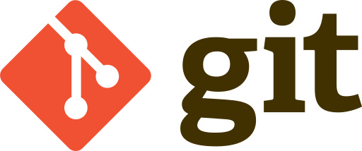

# Reto Git

## Descripción

El reto consiste en realizar las operaciones básicas para el manejo de Github y tener la habilidad de desarrollarlas.

## Características del reto
---
1. Creación de repositorios nuevos
2. Subida de archivos
3. Crear nuevas ramas
4. Descarga de contenido a local
5. Creación y edición de archivos
6. Ver el historial de cambios
7. Fusión de ramas

## Términos de operaciones básicas con GitHub
1.	Clone (Clonar):
    - Git: Clona un repositorio remoto en tu máquina local. Este comando crea una copia exacta del repositorio, incluyendo todas las ramas y el historial de commits.
    - GitHub: Puedes clonar un repositorio desde la interfaz web de GitHub o usando la URL del repositorio en tu terminal.
2.	Pull (Tirar):
    - Git: Descarga los cambios desde un repositorio remoto y los incorpora en tu rama local.
    - GitHub: Puedes hacer un pull desde la interfaz web de GitHub o utilizando el comando git pull en tu terminal.
3.	Push (Empujar):
    - Git: Sube tus cambios locales al repositorio remoto.
    - GitHub: Puedes hacer un push desde la interfaz web de GitHub o utilizando el comando git push en tu terminal.
4.	Commit:
    -	Git: Guarda los cambios realizados en los archivos de tu repositorio. Cada commit tiene un mensaje asociado que describe los cambios realizados.
    -	GitHub: Puedes realizar commits desde la interfaz web de GitHub o utilizando el comando git commit en tu terminal.
5.	Fetch (Recuperar):
    -	Git: Descarga todos los cambios del repositorio remoto a tu repositorio local, pero no los incorpora automáticamente en tu rama actual.
    -	GitHub: Se puede hacer un fetch desde la interfaz web de GitHub o utilizando el comando git fetch en tu terminal.
6.	Merge (Fusionar):
    -	Git: Combina los cambios de una rama en otra rama. Por ejemplo, puedes fusionar una rama de desarrollo en una rama principal como main o master.
    -	GitHub: Se puede hacer un merge desde la interfaz web de GitHub o utilizando el comando git merge en tu terminal.
7.	Branch (Rama):
    -	Git: Permite trabajar en paralelo en diferentes líneas de desarrollo. Cada rama puede contener cambios independientes.
    -	GitHub: Puedes crear, eliminar y administrar ramas desde la interfaz web de GitHub o utilizando el comando git branch en tu terminal.
8.	Pull Request (Solicitud de extracción):
    -	GitHub: Una solicitud de extracción es una forma de proponer cambios en un repositorio. Permite a otros revisar los cambios antes de fusionarlos en la rama principal. Se puede crear desde la interfaz web de GitHub.
  
### Página del reto:

Aquí puedes encontra la pigina del repositorio del reto a desarrollar:
[Reto Git](https://github.com/MiguelVL16/retogit)

